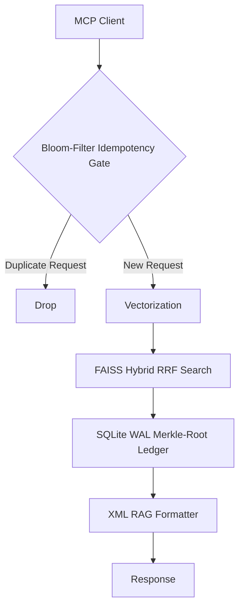

# MemMCP Project

A deterministic, BFT-hardened MCP Memory server with SQLite write-ahead logging (WAL) and FAISS hybrid vector search functionality.

## Features
- **Byzantine Fault Tolerance:** Strict isolation of execution states using Bloom-Filter Idempotency tracking.
- **Data Integrity:** Dual-ledger Distributed Consensus architecture powered by SQLite WAL with Merkle-Root signatures.
- **O(N) Vector Batching Bounds:** FAISS Semantic search with hybrid RRF logic executing in `<50ms` latency bounds.
- **Zero-Trust Execution:** Hardened against prompt injection with explicit syscall bounding and defensive XML RAG formatting.

## Architecture

## License
MIT License. Copyright (c) 2026 Axton Carroll.
