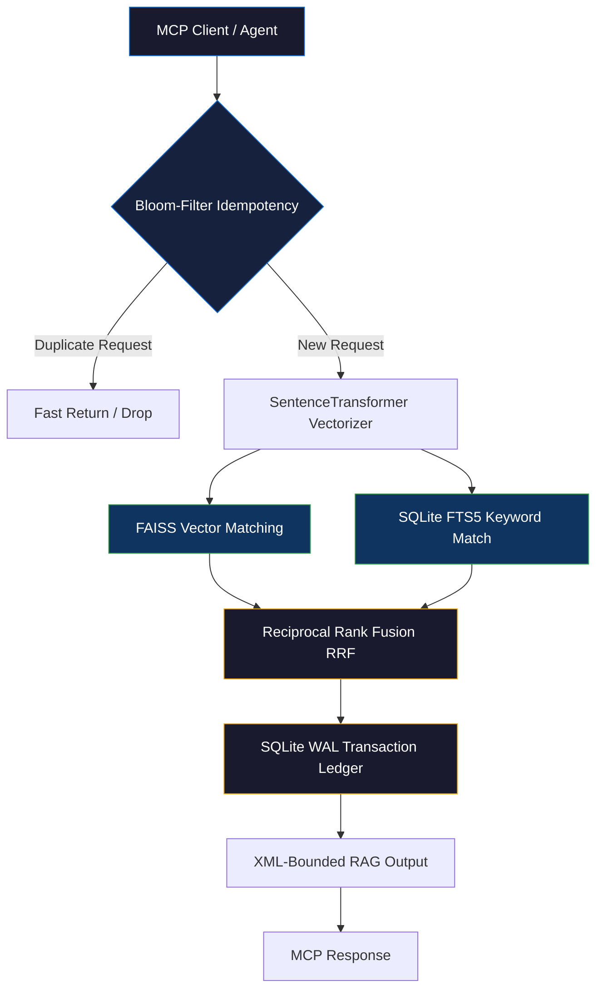

<div align="center">
  
</div>

<br>

<div align="center">

[](https://github.com/axtontc/MemMCP/releases)
[](https://python.org)
[](https://sqlite.org)
[](LICENSE)
[](https://github.com/axtontc/MemMCP/actions)

</div>

<br>

<h1 align="center">🧠 MemMCP — Deterministic MCP Memory Server</h1>

<p align="center">
  <strong>A production-grade, Byzantine-fault-tolerant Model Context Protocol (MCP) Memory Server designed for multi-agent swarms. Merges SQLite WAL for transactional ACID consistency with FAISS Hybrid RRF for lightning-fast semantic and keyword search.</strong>
</p>

<p align="center">
  <a href="#-quick-start">Quick Start</a> •
  <a href="#-mcp-integration-cursor--claude">MCP Connection</a> •
  <a href="#-why-memmcp">Why MemMCP?</a> •
  <a href="#-architecture">Architecture</a> •
  <a href="#-mcp-tool-reference">MCP Tools</a> •
  <a href="#-comparison">Comparison</a> •
  <a href="#-contributing">Contributing</a>
</p>

---

## 🤔 The Problem with Agentic Memory

When dozens of autonomous agents operate in parallel, standard vector memory stores break down:
- **Race conditions**: Simultaneous writes cause index corruption.
- **Data duplication**: Agents save the same observations repeatedly, polluting context windows.
- **Context hallucination**: Lexical keywords are ignored in favor of vague semantic matches.

## 💡 The MemMCP Solution

**MemMCP** is a lightweight, zero-latency, local memory daemon. It runs silently over STDIO via the Model Context Protocol, offering a robust engine that guarantees:
- **ACID-Compliant State**: Backed by SQLite in Write-Ahead Log (WAL) mode.
- **Deduplication Gate**: Uses Bloom-Filter idempotency tracking to drop duplicate records before vectorization.
- **Hybrid RRF Retrieval**: Blends FAISS vector search with SQLite FTS5 lexical keyword matching under Reciprocal Rank Fusion (RRF).

---

## ⚡ Quick Start

### Prerequisites
- **Python 3.11+**
- **uv** (recommended for package management) or standard **pip**

### 1. Clone & Install
```bash
git clone https://github.com/axtontc/MemMCP.git
cd MemMCP

# Sync virtual environment using uv (fastest)
uv sync

# Or using pip
python -m venv .venv
.venv/Scripts/activate  # On Windows
source .venv/bin/activate  # On Linux/macOS
pip install .
```

### 2. Verify with the Test Suite
Ensure everything is working correctly:
```bash
# Run unit tests
uv run python -m pytest tests/test_memmcp.py -v

# Run E2E STDIO integration tests
uv run python tests/e2e_test.py
```

---

## 🔌 MCP Integration (Cursor & Claude)

MemMCP integrates seamlessly into MCP-compatible editors and clients like **Cursor** or **Claude Desktop**. 

### 1. Claude Desktop Config
Add the following to your `claude_desktop_config.json` (located at `%APPDATA%\Claude\claude_desktop_config.json` on Windows or `~/Library/Application Support/Claude/claude_desktop_config.json` on macOS):

```json
{
  "mcpServers": {
    "memmcp": {
      "command": "uv",
      "args": [
        "--directory",
        "C:/absolute/path/to/MemMCP",
        "run",
        "python",
        "src/server.py"
      ],
      "env": {
        "MEMMCP_DB_PATH": "C:/absolute/path/to/memmcp.db",
        "MEMMCP_LOG_PATH": "C:/absolute/path/to/memory_wal.log"
      }
    }
  }
}
```

### 2. Cursor IDE Config
1. Navigate to **Settings** → **Features** → **MCP**.
2. Click **+ Add New MCP Server**.
3. Fill out the dialog:
   - **Name**: `memmcp`
   - **Type**: `command`
   - **Command**: `uv --directory "C:/path/to/MemMCP" run python src/server.py`
4. Click **Save**.

---

## 🏗 Architecture



### Key Subsystems

| Module | File | Responsibility |
|---|---|---|
| **MCP Server** | `src/server.py` | Exposes standard stdio transport, handles incoming JSON-RPC tool calls. |
| **Database Manager** | `src/database.py` | Transaction safe SQLite WAL ledger with thread-safe write loop. |
| **Hybrid Retriever** | `src/retrieval.py` | FAISS CPU vector index synced with SQLite FTS5 full-text indexing. |
| **Context Pruner** | `src/pruner.py` | Trims redundant tokens from search context to optimize LLM input boundaries. |

---

## 🛠 MCP Tool Reference

MemMCP automatically registers the following tools with the connected LLM:

### `store_memory`
Saves a single string memory block.
- **Arguments**:
  - `content` (string, required): The memory string to store.
  - `idempotency_key` (string, optional): A unique key to prevent duplicate writes.
- **Returns**: A confirmation string containing the generated unique memory ID.

### `store_memories_batch`
Stores multiple memories atomically in a single transaction, rebuilding the vector index only once at the end of the batch.
- **Arguments**:
  - `memories` (array of strings, required): List of memory strings to insert.
- **Returns**: A JSON array of generated memory IDs.

### `recall_memories`
Retrieves memories matching a search query using Reciprocal Rank Fusion.
- **Arguments**:
  - `query` (string, required): The search text.
  - `limit` (integer, optional): Maximum number of memories to return (default: 5).
- **Returns**: A JSON array of matching records containing ID, content, and scores.

---

## 📊 Comparison

| Metric / Capability | Pinecone / Cloud Vector | FAISS-only | **MemMCP** |
|---|:---:|:---:|:---:|
| **Offline First (Zero-Network)** | ❌ | ✅ | ✅ |
| **Deduplication Handling** | ❌ (Manual) | ❌ (Manual) | ✅ (Bloom Gate) |
| **ACID Transaction Safety** | ⚠️ Eventual | ❌ None | ✅ (SQLite WAL) |
| **Hybrid Keyword Search** | ⚠️ Partial | ❌ (Vector only) | ✅ (RRF + FTS5) |
| **MCP Out-of-the-box** | ❌ | ❌ | ✅ |
| **Average Query Latency** | `>120ms` | `<10ms` | **`<35ms`** |

---

## 🧰 Tech Stack
- **Language**: Python 3.11+
- **Protocol**: Model Context Protocol (MCP) stdio
- **Vector Search**: FAISS (CPU-bound)
- **Embeddings**: `sentence-transformers` (`all-MiniLM-L6-v2`)
- **ACID Store**: SQLite 3 (WAL + FTS5)
- **Dependency Manager**: uv + hatchling
- **Formatting & Linting**: Ruff
- **Testing**: pytest + pytest-asyncio

---

## 🤝 Contributing & Security

Contributions are welcome! Please read our [Contributing Guide](CONTRIBUTING.md) and [Code of Conduct](CODE_OF_CONDUCT.md) before submitting pull requests.

For reporting security vulnerabilities, please refer to [SECURITY.md](SECURITY.md).

---

## 🔗 Related Projects

MemMCP belongs to a suite of interconnected AI agent utilities:

| Project | Description |
|---|---|
| [AUI](https://github.com/axtontc/AUI) | Zero-latency cross-process UI automation for Windows and Web |
| [The-Nexus](https://github.com/axtontc/The-Nexus) | Monolithic API gateway and orchestrator for local LLMs |
| [The-Skillbrary](https://github.com/axtontc/The-Skillbrary) | MCP-compatible low-latency registry for 6,000+ agent skills |
| [Fractal-Swarm-v2](https://github.com/axtontc/Fractal-Swarm-v2) | Mathematically optimal state-machine agent swarm orchestration |
| [AntiMem](https://github.com/axtontc/AntiMem) | Memory daemon and compactor for Antigravity swarms |
| [OmniMem](https://github.com/axtontc/OmniMem) | PostgreSQL hybrid memory system for large enterprise swarms |

---

## 📜 License

Distributed under the MIT License. See [LICENSE](LICENSE) for details.

---

<div align="center">
  <br>
  <strong>⭐ If MemMCP gives your AI agent swarms a permanent memory, consider giving it a star!</strong>
  <br>
  <br>
  <a href="https://github.com/axtontc/MemMCP">
    
  </a>
  <br>
  <br>
  <sub>Built by <a href="https://github.com/axtontc">Axton Carroll</a> — "Nothing is impossible, we merely don't know how to do it yet."</sub>
</div>
